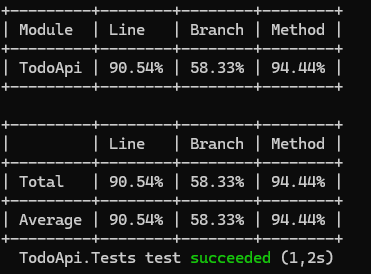

# Reflektions dokument

## Code Coverage

I arbejdet med code coverage begyndte vi med en afbalanceret tilgang mellem unit- og integrationstests. Unit-tests blev brugt til at dække den centrale forretningslogik i repository-laget, mens vi lagde en integrationstest per HTTP-endpoint for at validere endpointsnes happy path fungerede korrekt. Den første måling afslørede dog, at vores branch coverage lå under 60%, hvilket indikerede, at vores fejlhåndtering ikke blev udløst af de eksisterende tests.

For at målrette indsatsen brugte vi ReportGenerator til at visualisere utestede linjer og conditionals. Det gjorde det let at identificere konkrete huller, som fx validering af tom eller manglende titel, 404-flows ved tasks, opdatering og sletning af ikke-eksisterende id’er samt negative scenarier med id=0. På den baggrund lavede vi flere integrationstests, der rammer hele controller-flowet og sikrer realistiske data- og statusforløb. Samtidig fastholdt vi unit-tests omkring repository’et for at holde logikken hurtig at verificere og let at vedligeholde.

Målet var mindst 80% coverage som acceptkriterium, men givet projektets begrænsede omfang valgte vi at gå efter 100% line coverage. Vi er bevidste om, at høj coverage ikke i sig selv garanterer korrekthed, men det reducerer risikoen for utestet kernefunktionalitet, øger tilliden ved refaktorering og gør regressionsfejl lettere at opdage.

## Load testing

Vi udførte belastningstests med Abstracta.JmeterDsl i C# for at simulere 50-100 samtidige brugere. Den basale test fokuserede på GET /tasks med 10 brugere (50 iterationer), hvilket resulterede i 1500 samples, gennemsnitlig responstid på 20 ms, throughput på 947 req/s og 0% fejl. Den blandede test med 100 brugere (5 iterationer) dækkede CRUD-operationer og gav 3000 samples, gennemsnit 78 ms (op til 156 ms for tungere requests som PUT/DELETE), throughput 2228 req/s og ingen fejl.

Resultaterne viser, at API'et performer godt under moderat load: lave responstider, høj throughput og ingen fejl indikerer robusthed med in-memory database. Outliers (99% percentile op til 890 ms) tyder på sporadiske delays fra concurrency.

For optimering kunne vi tilføje caching til GET for at reducere DB-adgang, bruge asynkrone metoder fuldt ud, eller skifte til en reel database med indeksering for bedre skalering. Ved højere load anbefales horisontal skalering eller load balancing for at holde responstider under 100 ms.
